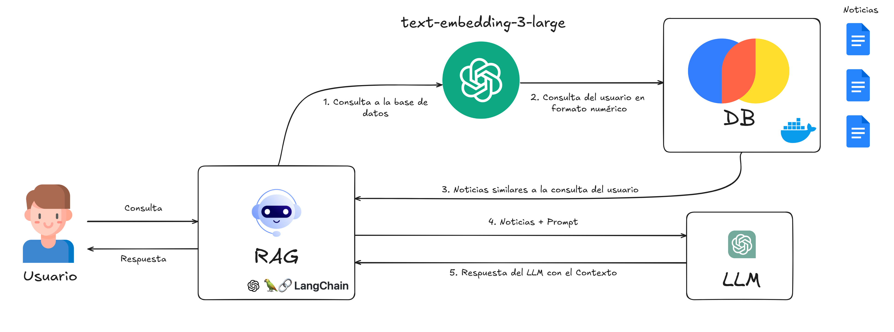

# **RETO EMPRESARIAL QUBIKA**

## **Introducción**

Este proyecto tiene como objetivo construir un sistema de *Retrieval-Augmented Generation* (RAG) capaz de generar 
respuestas utilizando un *Large Language Model*. El sistema se basa en la integración de información contextual 
almacenada en una base de datos vectorial y procesada a partir de documentos de noticias extraídos mediante técnicas 
de *web scraping*. Los datos procesados se emplean para enriquecer las consultas realizadas al modelo, asegurando 
la generación de respuestas relevantes y precisas. 

El proyecto está compuesto por los siguientes módulos principales:  
1. **Scraping de datos:** Extracción de información de sitios web relevantes.  
2. **Base de datos vectorial:** Almacenamiento optimizado para recuperación eficiente de información.  
3. **Generación de respuestas:** Procesamiento avanzado mediante LLM.  
4. **Interfaz de usuario:** Plataforma interactiva para consultas y visualización de datos.  

Este sistema se diseñó con el propósito de explorar y aplicar tecnologías de inteligencia artificial para mejorar 
la accesibilidad y el uso de información estructurada en contextos reales.

## **Sección de Reporte**

Puedes consultar el reporte detallado del sistema en el archivo [`report.md`](./report/report.md).


## **Arquitectura**




## **Configuración**

Existen dos formas de configurar el proyecto, la primera es utilizando Docker y la segunda es de forma local. 

### **Configuración Local**

1. Clonar el repositorio
    ```bash
    git clone https://github.com/CristianPerafan/qubika-challenge.git
    ```
2. Crear un entorno virtual
    ```bash
    python -m venv venv
    ```
3. Activar el entorno virtual

    Windows:
    ```bash
    venv\Scripts\activate
    ```
    Linux:
    ```bash
    source venv/bin/activate
    ```

4. Instalar dependencias
    ```bash
    pip install -r requirements.txt
    ```
   
5. Debes correr Chroma en un contenedor de Docker, con el fin de que el RAG se pueda comunicar con la base de datos via http. 
   Para ello, debes seguir los siguientes pasos:
      ```bash
      docker pull chromadb/chroma
      docker run -p 8000:8000 chromadb/chroma
      ```
6. Crear un archivo `.env` en la raíz del proyecto con las siguientes variables de entorno
    ```env
   OPENAI_API_KEY=sk-XXXXXXXX
   CHROMA_HOST=localhost
   CHROMA_PORT=8000
   ```
7. Ejecutar la interfaz web
    ```bash
    streamlit run app.py
    ```
8. Acceder a la interfaz web en `http://localhost:8501`
   
### **Configuración con Docker Compose**

1. Clonar el repositorio
    ```bash
    git clone https://github.com/CristianPerafan/qubika-challenge.git
    ```

2. Crear un archivo `.env` en la raíz del proyecto con las siguientes variables de entorno
    ```env
    OPENAI_API_KEY=sk-XXXXXXXX
    CHROMA_HOST=chroma
    CHROMA_PORT=8000
    ```
   
3. Correr el docker-compose
    ```bash
    docker-compose up --build
    ```
4. Acceder a la interfaz web en `http://localhost:8501`


